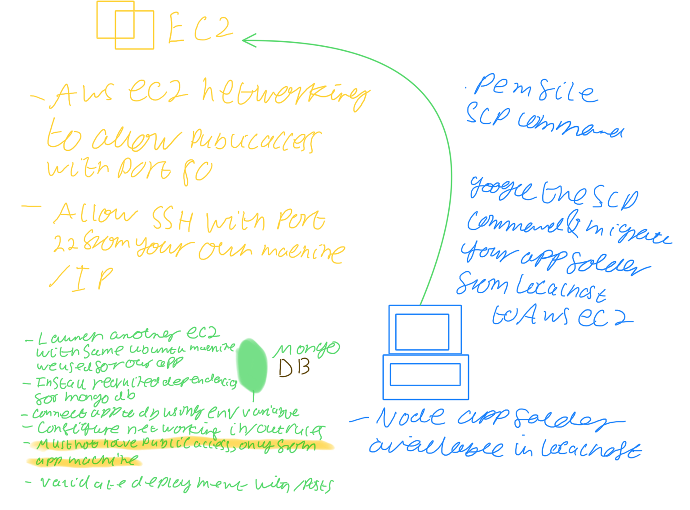

# 2 tier app deployment

## Deploy steps
1. Copy code from host machine to AWS ec2 instance
2. Install required dependencies for node app
3. npm install
4. npm start
5. Should see node app with public ip port 3000

## Second iteration
1. Reverse proxy with nginx so we can get the node app working in the browser without the port

## Third iteration
1. Spin up another ec2 instance with same ubuntu 16.04 to set up MongoDB

## Final iteration
1. Connect the app with MongoDB ec2 to see the /posts working in the browser with public IP

Hint: Use scp command (secure copy)

So, how did we end up copying the file?
First, I moved into the directory with the app folder and then just ran this command:
```console
scp -i "/Users/monotiller/.ssh/eng89_devops.pem" -r  "app" ubuntu@ec2-3-250-106-255.eu-west-1.compute.amazonaws.com:app/
```

## Case scenario (on site)
Clients have an app running on vagrant or any other software and they want to migrate to cloud.

We have done 50% of the things already (AWS account, keys, etc) - We might have to do this ourselves in the future.

All of us have access to AWS instances and other AWS services.

The client's app is working on a monolith architecture, we should migrate it to cloud and make it highly available.

Before moving on to n-tier architectures, during end of sprint, always talk to clients to see that everyone is on the same page.

## Setting up the app instance
- SSH in to the instance using the information given in the ec2 dashboard
- Updating our VM: `sudo apt-get update -y`
- Upgrading our VM: `sudo apt-get upgrade -y`
- Installing nginx: `sudo apt-get install nginx -y`
- Installs node.js:
    ```console
    sudo apt install node.js -y
    curl -sL https://deb.nodesource.com/setup_6.x | sudo -E bash -
    sudo apt install nodejs -y
    ```
- Installs pm2 globally: `sudo npm install pm2 -y -g`
- Checks status of nginx: `systemctl status nginx`
- Setting up the reverse proxy. Go to: `/etc/nginx/sites-available`
  - Then: `sudo rm -rf default`
  - Then you'll need to create a new `default` file with the following properties:
    ```console
    server {
        listen 80;

        server_name _;

        location / {
            proxy_pass http://192.168.10.100:3000;
            proxy_http_version 1.1;
            proxy_set_header Upgrade $http_upgrade;
            proxy_set_header Connection 'upgrade';
            proxy_set_header Host $host;
            proxy_cache_bypass $http_upgrade;
        }
    }
    ```
- Set the database location as an env variable:
    ```console
    sudo nginx -t
    cd /home/vagrant/
    export DB_HOST=mongodb://[ip of db instance]:27017/posts
    ```

## Setting up DB intance
- Key server for missing signed keys in mongo installation files: `sudo apt-key adv --keyserver hkp://keyserver.ubuntu.com:80 --recv D68FA50FEA312927`
- Getting the mongo repo: `echo "deb https://repo.mongodb.org/apt/ubuntu xenial/mongodb-org/3.2 multiverse" | sudo tee /etc/apt/sources.list.d/mongodb-org-3.2.list`
- Updating our VM: `sudo apt-get update -y`
- Upgrading our VM: `sudo apt-get upgrade -y`
- Installing the mongo packages we want: `sudo apt-get install -y mongodb-org=3.2.20 mongodb-org-server=3.2.20 mongodb-org-shell=3.2.20 mongodb-org-mongos=3.2.20 mongodb-org-tools=3.2.20`
- Changing the config files to make DB accessible. Move into the `/etc` directory
  - Delete `mongod.conf`
  - Create a file called `mongod.conf` with the properties:
```console
storage:
  dbPath: /var/lib/mongodb
  journal:
    enabled: true
systemLog:
  destination: file
  logAppend: true
  path: /var/log/mongodb/mongod.log
net:
  port: 27017
  bindIp: 0.0.0.0
```
- Move back in to the folder with the DB files hosted and run: `sudo systemctl restart mongod`
- Then: `sudo systemctl enable mongod`

## Setting up the security permissions:
### App instance
In order for our app to connect to our db, we need to set up the following in security permissions:

| Name  | Security group rule ID  | IP version            | Type  | Protocol   | Port range  | Source  | Description       |                                         |
|-------|-------------------------|-----------------------|-------|------------|-------------|---------|-------------------|-----------------------------------------|
|       | –                       | sgr-0837ff0e8e003056b | IPv4  | Custom TCP | TCP         | 3000    | 0.0.0.0/0         | Allow us to browse node app             |
|       | –                       | sgr-0ab2ea10bf8afcb8a | IPv6  | HTTP       | TCP         | 80      | ::/0              | For users to access through web browser |
|       | –                       | sgr-0336b5290aa11cfea | IPv4  | SSH        | TCP         | 22      | [your ip address]/32 | For me to access through SSH            |
|       | –                       | sgr-001e80fc3ed4a434c | IPv4  | HTTP       | TCP         | 80      | 0.0.0.0/0         | For users to access through web browser |

### DB instance
Now the other way around for our DB to allow connections from our app:

| Name  | Security group rule ID  | IP version            | Type  | Protocol   | Port range  | Source  | Description       |                                |
|-------|-------------------------|-----------------------|-------|------------|-------------|---------|-------------------|--------------------------------|
|       | –                       | sgr-0287a2cbc6272c7aa | IPv4  | Custom TCP | TCP         | 27017   | [ip address of app instance]/32  | Connections to the mongodb     |
|       | –                       | sgr-0c128cef57b964c2c | IPv4  | Custom TCP | TCP         | 3000    | [ip address of app instance]/32  | Connections from nodejs        |
|       | –                       | sgr-0970d2001a58d95a9 | IPv4  | SSH        | TCP         | 22      | [your ip address]/32 | For me to SSH in to the server |